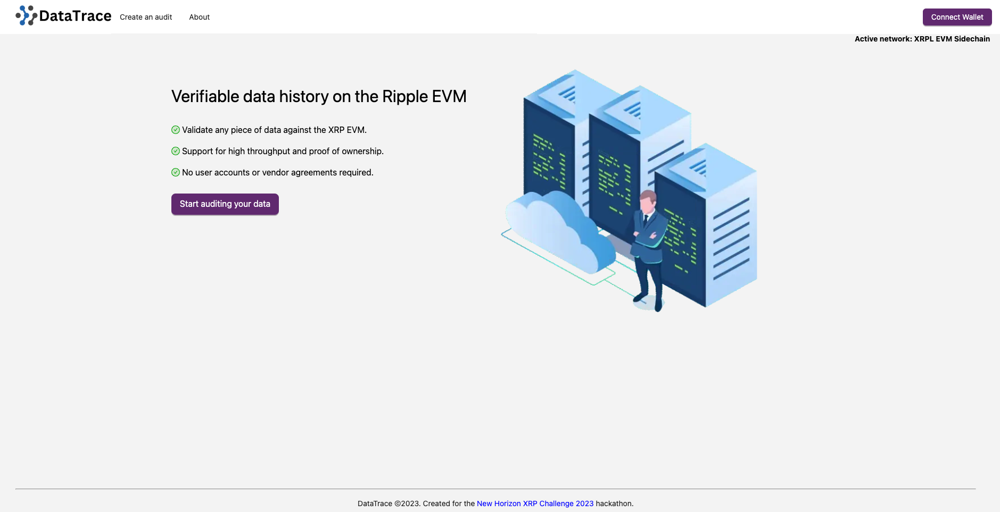
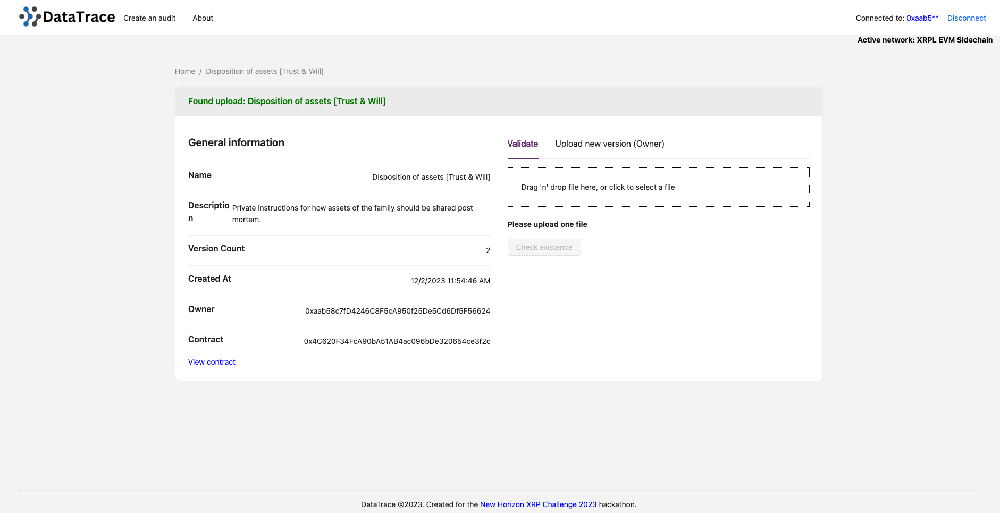
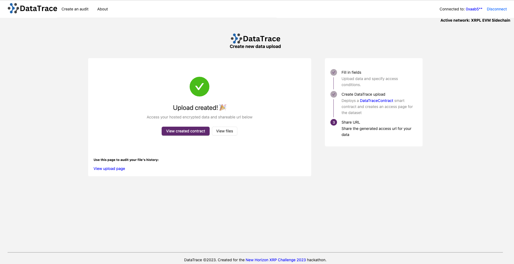
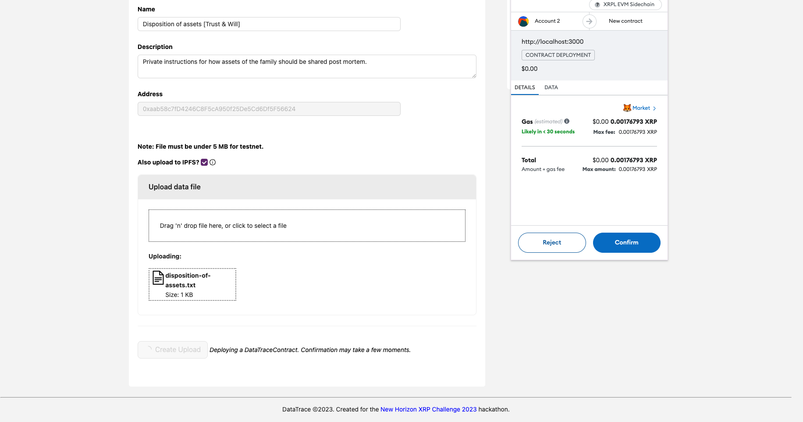
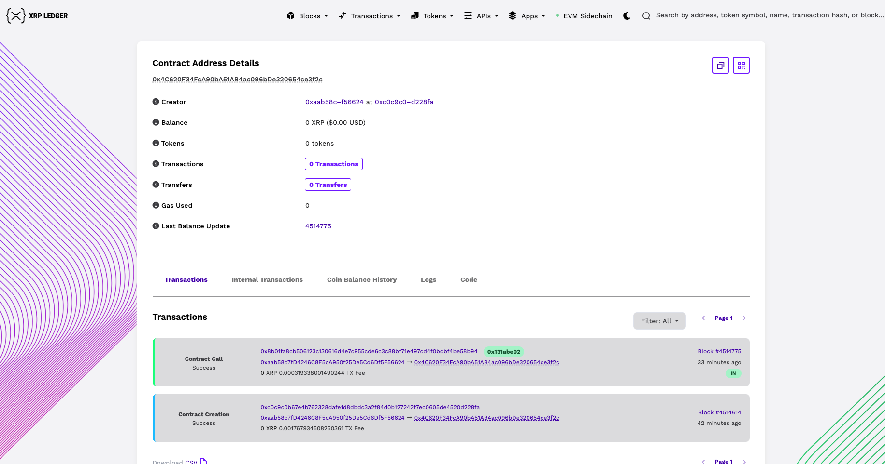
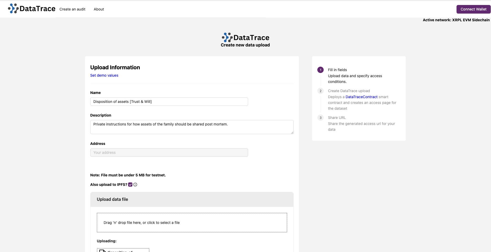
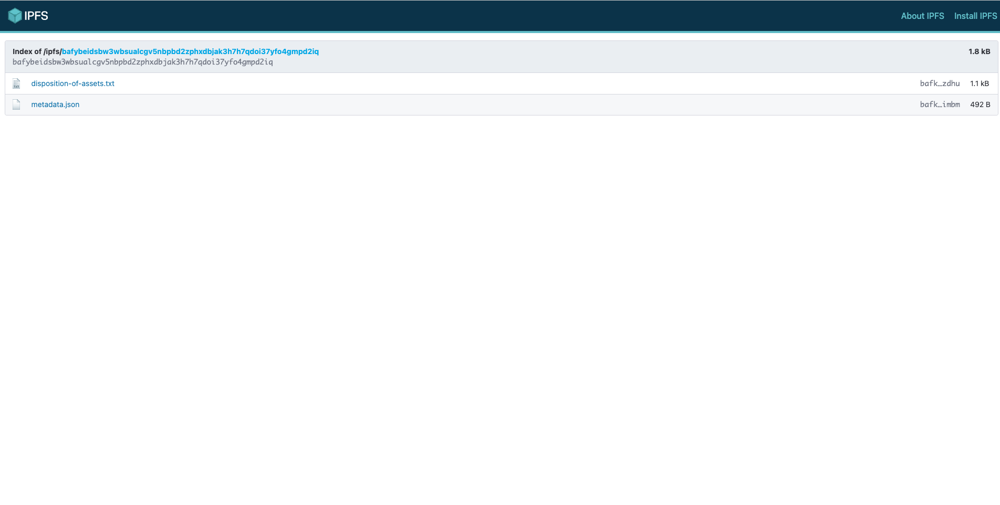
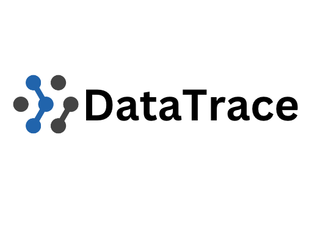
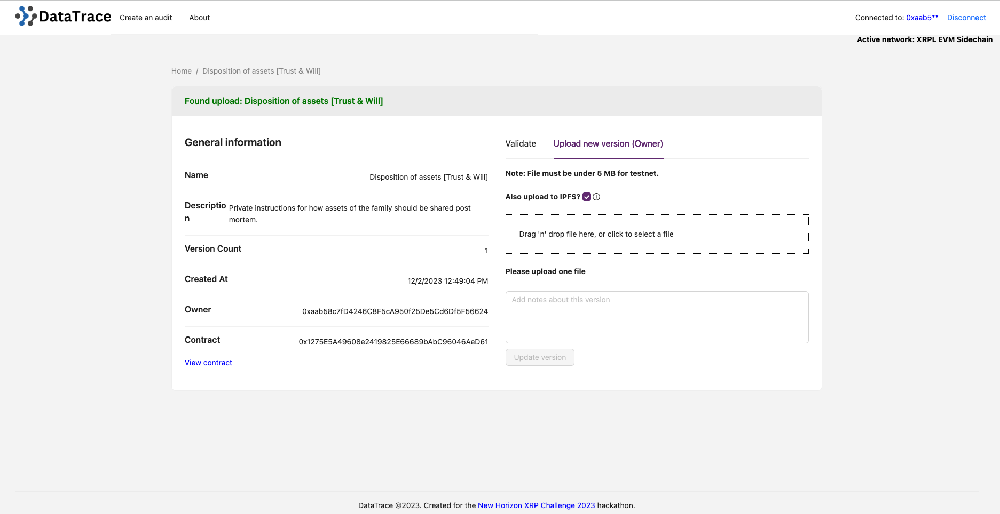

 

    

 

DataTrace
---

Validate any piece of data against the XRP EVM with proof of ownership.

DataTrace is a high throughput data validation platform built on Ripple EVM where every piece of data gets a unique smart contract, Filecoin URL, and verifiable audit history.

<!-- Built for the XRP EVM 2023 hackathon

Demo video:  -->

You must ensure you have the XRP Ledger Devnet added to your metamask config, otherwise metamask may not be able to connect. Follow the guide here: https://opensource.ripple.com/docs/evm-sidechain/connect-metamask-to-xrpl-evm-sidechain/

Built for the <a href="https://newhorizon.devpost.com/" target="_blank">New Horizon hackathon</a> 2023.

Live demo url: https://xrp23.vercel.app/

<!-- Demo video:  -->

## Inspiration

In today's digital age, data is a crucial asset, but its integrity and validation remain challenging. DataTrace was inspired by the need for a high-throughput validation platform for data that leverages the power of Ripple EVM. We were driven by the vision of creating a secure, transparent, and accessible system where every piece of data is accompanied by a unique URL and an evolution pattern, ensuring trust and accountability in the data-driven world.

## What it does
DataTrace is a cutting-edge data validation platform that operates on Ripple EVM. It empowers users to validate and track data with unprecedented ease and transparency. With DataTrace, users can assign a unique URL to each piece of data, creating a permanent, immutable record. The platform also tracks the data's evolution over time, ensuring its accuracy and integrity. This system enhances data trustworthiness, making it ideal for use cases like supply chain management, financial transactions, and beyond.

## How we built it

Building DataTrace was a collaborative effort that combined the power of Ripple EVM with innovative technologies. We designed and implemented smart contracts to record and verify data, ensuring it remains immutable. Additionally, we developed a user-friendly web interface that allows users to interact with DataTrace effortlessly. The project leverages decentralized storage solutions to securely store data and maintain its unique URLs and evolution patterns.

## Challenges we ran into

Creating DataTrace came with its fair share of challenges. Integrating Ripple EVM into the project required extensive research and development to ensure seamless compatibility. Additionally, designing a system that maintains data integrity without compromising on performance was a complex task. We also had to address various security concerns and optimize the platform for high throughput, which presented its own set of challenges.

## Accomplishments that we're proud of

Throughout the development of DataTrace, we achieved several milestones that make us proud. We successfully integrated Ripple EVM into the platform, allowing it to benefit from Ripple's high throughput capabilities. We also designed a user-friendly interface that simplifies data validation for users of all backgrounds. Furthermore, the system's ability to generate unique URLs and evolution patterns for each data point is a significant accomplishment that enhances data trust.

## What we learned

Working on DataTrace was a learning experience. We gained valuable insights into the intricacies of Ripple EVM and blockchain technology. We also deepened our understanding of data validation and its importance in today's digital ecosystem. This project has taught us the significance of innovation and adaptability when addressing complex challenges in the blockchain and data validation space.

### Recompiling the DataTrace smart contract for deployment on XRP EVM

This contract project uses forge foundry for builds https://book.getfoundry.sh/reference/forge/forge-build

Compiling contracts:
`yarn build`

Copy contents of `.json` contract output to `metadata.js` in the app project.

## Running the project (from scratch)

1. Copy `.env.sample` -> `.env`

2. Define variables in `.env` with your unique values.

3. `yarn; yarn dev`. The app should now be running on port 3000.

Any repeated starts can be done with `yarn dev` once all environment variables are set.

## Production build

You can deploy your own version of DataTrace on the web for internal or public use.

1. Follow config steps above in 'Running the project'

2. `yarn; yarn build`

3. Copy the contents of `build` to the CDN of your choosing.

### Screenshots

#### Home

         

## Potential future work
1. Mainnet deployment and support: DataTrace is currently deployable on Ripple EVM testnet and is free to use - mainnet deployments would offer more long term guarantees and stability.
2. Security audit and review: Ensure the highest level of data security, privacy, and resistance to potential attacks. Do repeated testing to ensure that encrypted data can only be accessed when all the conditions are met.
3. Integration with additional blockchains: Cross chain interactions on the app require configuring source and destination addresses in the DataTrace app - more sources could be added and maintained.

### Useful links
* Contest: https://newhorizon.devpost.com/
* Faucet (getting sidechain XRP): https://witness-evm-sidechain.peersyst.tech/
